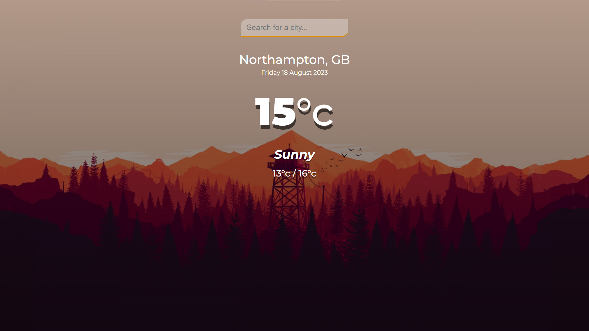

# weather-app-project-with-API-

This is a solution to the [Weather App Project With API].

## Table of contents

- [Overview](#overview)
  - [Screenshot](#screenshot)
  - [Links](#links)
- [My process](#my-process)
  - [Built with](#built-with)
- [Author](#author)

## Overview

### Screenshot

### Links

- Solution URL: (https://github.com/Ali28202/weather-app-project-with-API-)

## My process

- Display the weather of the city or country you need

### Built with

- Semantic HTML5 markup
- CSS custom properties
- Flexbox
- JavaScript
- Open Weather API

## Author

- Github - [@Ali28202](https://github.com/Ali28202)
